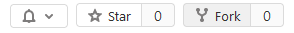

# COMP2100/6442 Labs
Welcome to COMP2100/6442. This repository is where you will find all your labs.

## Setting up your git repository
Before you can start commiting and pushing you work, you need to make a copy of this repository for yourself. To do this, please click on the 'fork' button on the top right hand corner of this repository as seen below.

Once you have done this, you can now clone the repository and begin!

## Links
- We care about your mental health, if you ever need help beyond the course content please check out [ANU's academic support and student advocacy services](https://www.anu.edu.au/students/health-safety-wellbeing/violence-sexual-assault-support/anu-community-support-services-0) as well as [ANU's counselling service](https://www.anu.edu.au/students/health-safety-wellbeing/getting-help-at-anu/anu-counselling).
